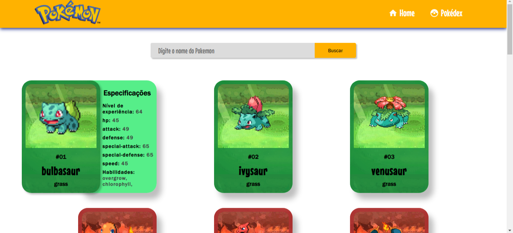

# Pokédex
Project that consumes a pokemon API

## 🛠️ Built with
* HTML5
* CSS3
* Javascript
* React
* Hooks
* Props
* JSX

### 📋 Prerequisites

To edit this project, you can fork it, clone down this repository or download it to your computer. You need to have installed:

Visual Studio Code (or any text editor);

## ⚙️ Installation and Setup Instructions

Clone down this repository. You will need `node` and `npm` installed globally on your machine.  

Installation:

`npm install`  

To Run Test Suite:  

`npm test`  

To Start Server:

`npm start`  

To Visit App:

`localhost:3000/pokemon`

---
Made with ❤️ by [Gabriel](https://github.com/GabrielAguiarDev) 👀